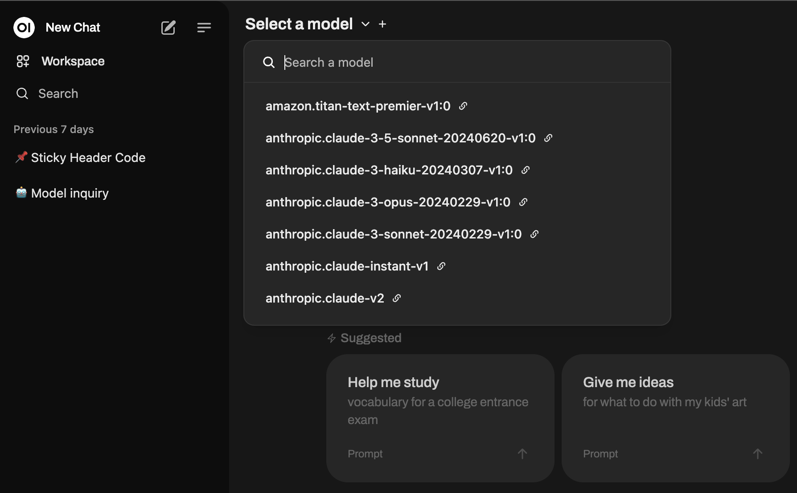

# Bedrock Open UI

[Open Web UI](https://openwebui.com/) + AWS Bedrock to OpenAI gateway in one package.



Currently supported models:
- Anthropic Claude 2 / 3 / 3.5 (Haiku/Sonnet/Opus)
- Meta Llama 2 / 3
- Mistral / Mixtral
- Cohere Command R / R+
- Cohere Embedding

## Prerequisites!
- Docker installed on your machine
- AWS credentials with permissions to use AWS Bedrock
- AWS Bedrock models approved for your account

## Installation

- Rename the `.env.example` file to `.env` and fill in the required values of AWS credentials, or
```bash
export AWS_ACCESS_KEY_ID=your_access_key_id
export AWS_SECRET_ACCESS_KEY=your_secret_access_key
export AWS_DEFAULT_REGION=us-east-1 # Default region
export AWS_SESSION_TOKEN=your_session_token # Optional
```
>Note: Env variables have higher priority than the `.env` file.

- Install Bedrock Open UI with Docker Compose:

```bash
docker compose up
```
- Wait for the build and pull images to finish
- Open http://localhost:3000